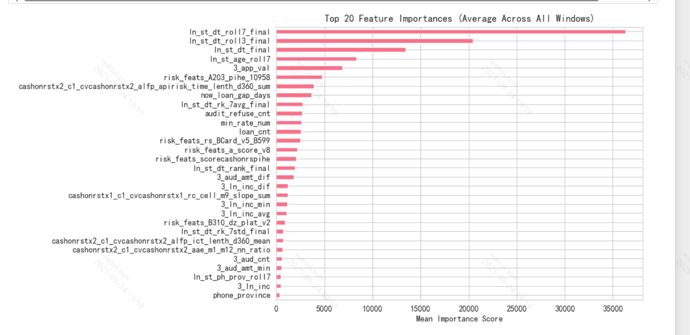
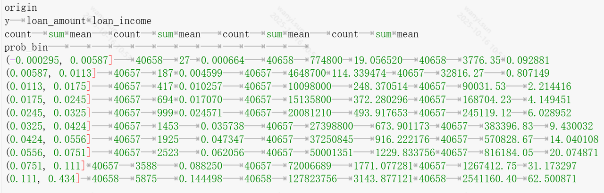
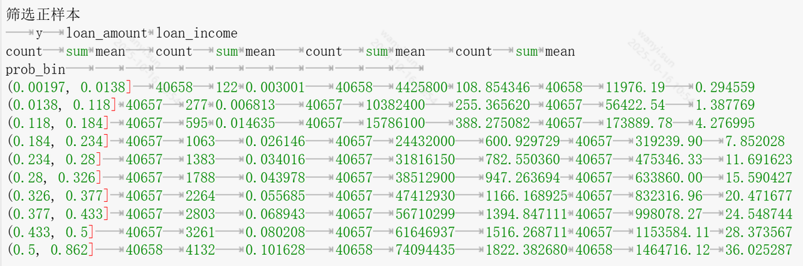

二分类模型，标签为是否放款；只保留 含有正样本且样本数量大于1 的用户训练思路
1. 业务场景
- 目标：预测用户在不同候选产品上的放款可能性，并根据预测概率对产品进行排序。
- 应用场景：对同一个用户的多个产品进行推荐排序，核心关注点是 用户内排序效果。
- 特点：
  - 用户维度：每个用户对应多个候选产品。
  - 标签（y）：是否放款，二分类。
  - 存在大量 纯负用户（历史上从未放款），这些用户缺乏排序监督信号。

---
2. 样本选取
- 训练集：
  - 仅保留在训练时间段内 至少有一个正样本的用户。
  - 避免模型浪费资源在纯负用户上（这类用户在训练中无法提供排序信号）。
- 验证集 & 测试集：
  - 保留 全部用户（包括纯负用户）。
  - 目的：
    - 评估模型在有正样本用户上的排序效果（核心任务）。
    - 评估模型在全体用户上的泛化能力（保证线上稳定性）。
- 数据切分：
  - 按时间顺序采用滑动窗口方式：
    - Train → Val → Test 连续划分。
    - 窗口大小：train_days / val_days / test_days。
    - 步长：window_step，逐步滑动形成多个时间窗口。

---
3. 建模逻辑
1. 特征工程
  - 结构化特征：用户画像、产品属性、交互特征等。
  - 时间序列特征：shift、rolling、rank、统计量等。
  - JSON 字段：用 orjson 解析，只保留需要的字段，避免生成大而稀疏的表。
2. 训练策略
  - 模型：二分类模型（如 LGBM / XGBoost / 神经网络）。
  - 目标：学习用户在不同产品上的放款概率。
  - 样本：仅包含 有正样本的用户，保证排序信号有效。
3. 预测与推荐
  - 对每个用户的候选产品，输出概率分数。
  - 按分数排序，推荐 Top-K。

---
4. 评估方法
评估分为两类指标，分别对应业务核心和模型泛化：
4.1 核心任务指标（用户内排序效果）
- 只在 有正样本用户 上计算：
  - NDCG@k：衡量正样本在前列的排序质量。
  - MAP（平均精度）：正样本越靠前，得分越高。
  - MRR（平均倒数排名）：第一个正样本出现的位置。
- 解释：衡量模型在真正有放款记录用户上的推荐效果。
4.2 全局指标（模型泛化能力）
- 在 所有用户 上计算：
  - AUC：全局区分正负样本能力。
  - Logloss / Brier Score：概率预测是否校准。
  - 其他：Accuracy、Precision、Recall（辅助观察）。
- 解释：确保模型不仅在有正样本用户上有效，还能对纯负用户做出合理预测，保证线上稳定性。

---
4. 方法优势
- 避免了在训练中使用无监督信号（纯负用户），提升模型排序学习效果。
- 保留全量用户在验证/测试中的表现，保证泛化能力评估完整。
- 双指标体系（排序指标 + 全局指标）能同时兼顾业务收益和模型稳定性。
- 时间滑窗切分方式避免了数据泄漏，并能检验模型在不同时间段的鲁棒性。
5. 业务建模逻辑与评估方法
🎯 场景介绍
- 任务：对同一用户的多个候选产品打分排序。
- 目标：提升整体放款规模（放款数量 / 金额）。
- 特点：业务只涉及 用户内的产品比较，不需要跨用户判别。

---
📉 为什么全局 AUC 不适合
- AUC 衡量的是全局区分能力：在所有样本中，随机挑一个正样本和负样本，模型能否区分。
- 这隐含了“跨用户比较”的能力，但业务中并不需要。
- 因此，全局 AUC 的下降（如 -0.1）只是说明模型不再区分“哪些用户永远没有正样本”，对实际业务影响不大。

---
📈 为什么 GAUC / NDCG / TopK 更相关
- GAUC / NDCG / TopK 都是 用户内排序指标，直接对应业务场景：
  - GAUC：用户内 AUC 的加权平均。
  - NDCG@K：衡量推荐结果在前 K 位的排序质量。
  - TopK-HitRate：用户的 Top-K 推荐里是否包含正样本。
- 这些指标提升（+0.01）说明模型在用户内排序效果变好 → 用户更可能被推荐到正确产品 → 整体放款规模提升。

---
✅ 建模建议
- 训练集
  - 使用只包含有正样本的用户（去掉纯负用户）。
  - 使模型专注于学习“用户内正负区分”。
- 验证 / 测试集
  - 保持全量（包含纯负用户），但主要在 有正样本用户集合 上计算排序指标。
  - 全局 AUC 仅作为参考，避免模型失控。
- 评估指标优先级
  1. 核心指标：NDCG@K、MRR（用户内排序质量）
  2. 次要指标：Top-K HitRate（召回率）
  3. 辅助指标：GAUC（加权的用户内 AUC）
  4. 参考指标：全局 AUC（仅 sanity check）

---
📊 对业务方的解释
- “我们的业务目标是提升整体放款规模，而这取决于用户内产品排序的准确性。”
- “虽然全局 AUC 下降，但这不是我们线上业务要解决的问题；
关键指标 GAUC、NDCG、TopK 提升，说明用户更可能在推荐的前几位就获得合适的放款产品，直接贡献业务规模。”

tips：折中方案
先筛选正样本，再对剩下的负样本数据进行采样，按照uid、dt分组，完整采样到每个组，保证1:1（即筛选正样本后10万条样本，则再采样10万条负样本）
目的：用含有正样本且样本数大于1的用户直接训练，gauc和ndcg均有提升，但auc和分层降幅明显，折中方案兼顾两者指标
6. 离线评估结论：
特征重要性：
pid维度特征和pid_用户交叉特征重要性明显提升，即模型区分不同产品的排序能力上升，之前是单用户维度特征重要性较高，即模型区分0、1效果好（好用户放款概率高）

AUC：
origin（无交叉特征，不筛选字段，不筛选正样本）
=== 指标统计 ===
       train_auc   val_auc  test_auc
mean    0.806128  0.777370  0.773257

筛选正样本
=== 指标统计 ===
       train_auc   val_auc  test_auc
mean    0.768064  0.713624  0.714351

筛选正样本+采样负样本  20%
=== 指标统计 ===
       train_auc   val_auc  test_auc
mean    0.789481  0.782371  0.780860

NDCG
origin                       平均NDCG@3 = 0.7502032426709978
筛选正样本                   平均NDCG@3 = 0.7702724850863211
筛选正样本+采样负样本 20%    平均NDCG@3 = 0.7667284850867515

GAUC
origin 
GAUC Results for All Labels:
          label      gauc  total_groups  total_samples  skipped_groups
0             y  0.698368         14751          60666          133893
1  audit_result  0.678570         34768         138595          113876

筛选正样本
GAUC Results for All Labels:
          label      gauc  total_groups  total_samples  skipped_groups
0             y  0.722767         14751          60666          133893
1  audit_result  0.690632         34768         138595          113876

筛选正样本+采样负样本  20%
GAUC Results for All Labels:
          label      gauc  total_groups  total_samples  skipped_groups
0             y  0.720039         14751          60666          133893
1  audit_result  0.696431         34768         138595          113876

分层：

7. 线上指标及分析
配置及结论
线上模型修改逻辑：使用全部进件样本—>仅使用样本量大于1且含有正样本的用户
线上实验重点关注指标：进件价值=收入/进件笔数
上线实验：老客非优质用户层
最终线上收益：非L老客层实验组相比对照组增益由3%提升至5%

收益分析
1️⃣ 噪声样本减少，信号更清晰
在所有用户中：
- 单样本用户（只申请一个产品）→ 没有“选择”过程；
- 全负样本用户（所有产品都未放款）→ 标签可能受非模型特征影响（如风控规则、额度不足、外部系统原因）；
这些样本的标签（0/1）不一定反映真实的模型可学习信号。
例如：
用户	进件产品数	是否放款	原因
A	1	0	因为额度问题被拒，但产品有价值
B	3	1,0,0	模型能学习区分高风险与低风险产品
A 的样本噪声高，对模型来说“放款=0”并不代表产品不好；
 B 的样本信号强，能反映真实偏好/风险差异。
🔹 过滤掉 A 这类样本后：
- 模型只看到真实可学习的模式；
- 参数拟合更稳定；
- 推理阶段预测分布更可靠。
👉 本质上，你提升了 信号纯度（Signal-to-Noise Ratio, SNR）。
2️⃣ 避免模型过拟合于“无放款”群体
全负样本用户通常占比高（约为80%），
 直接训练会让模型学成“放款概率极低”的全局判断器：
几乎所有样本（90%）预测值都小于0.1，这样在AUC上看似不错，
 但在排序/收益上毫无意义。
过滤掉这些组后：
- 训练样本中放款比例提升；
- 模型学习重心转向“区分高低收益”；
- 输出分数拉开区分度（详见分层结果）；
- 线上筛选效果更明显。
3️⃣ 模型更贴近线上使用场景（distribution alignment）
线上决策逻辑一般是：
“用户来了 → 给他推荐多个候选产品 → 按模型打分排序 → 按顺序推送产品”
在这个使用场景下，模型面对的输入样本都是「多产品、存在竞争关系」的用户。
 而单样本或全负样本的用户：
- 在线上几乎不会触发“排序逻辑”；
- 即使出现，也不会对总收入造成显著贡献。
🧠 所以过滤这些样本，其实是让训练集分布 更接近线上真实决策分布。

📈 这种「训练–推理分布一致性（Train–Inference Distribution Alignment）」
 是影响收益模型最关键的因素之一。
过滤掉部分数据并不一定是坏事，尤其当：
数据被过滤的原因	对模型的意义
样本无排序结构（单样本组）	无法学习用户偏好
标签信息噪声高（全负组）	模型学习错误信号
对业务目标无影响（无放款潜力用户）	训练无收益
